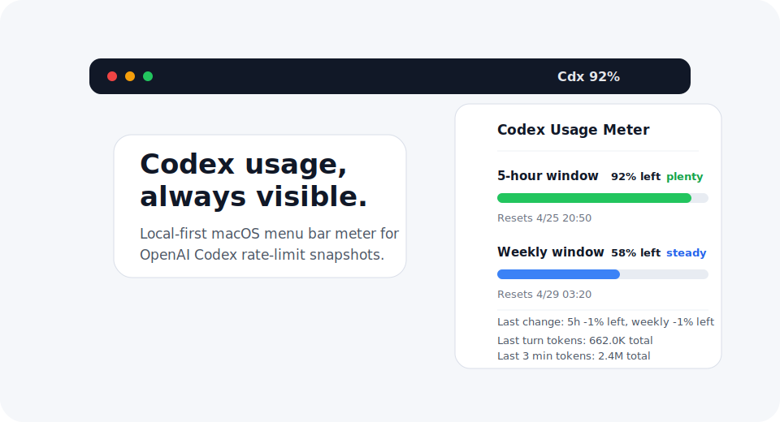

# Codex Usage Meter

A tiny macOS menu bar app that keeps your OpenAI Codex usage limits visible while you work.

Codex Usage Meter reads the local Codex session logs already stored on your Mac and shows the latest rate-limit snapshot in the menu bar. No extra login, browser tab, API key, or background network polling is required.

> Unofficial project. Not affiliated with OpenAI.



## What It Shows

- A compact menu bar label like `Cdx 92%`
- A visual gauge for the 5-hour Codex usage window
- A visual gauge for the weekly Codex usage window
- Percentage labels beside each gauge
- Last-change estimate based on the previous distinct Codex usage snapshot
- Reset times for both windows
- A shortcut to the official Codex usage dashboard
- A small CLI status output with local token stats

## Why

Codex is easiest to use when you can see your remaining usage at a glance. The official dashboard is useful, but it lives in a browser. This app puts the important part directly in the macOS menu bar.

## Requirements

- macOS 13 or newer
- Swift toolchain, included with Xcode Command Line Tools
- OpenAI Codex installed and used at least once on this Mac
- Local Codex session files under `~/.codex/sessions`

Install Xcode Command Line Tools if `swift` is missing:

```bash
xcode-select --install
```

## Install

```bash
git clone https://github.com/SangdonLee972/codex-usage-meter.git
cd codex-usage-meter
./scripts/install.sh
```

The installer builds the app, installs the binary to `~/.local/bin/codex-usage-meter`, and registers a user LaunchAgent so it starts automatically when you log in.

## Uninstall

```bash
./scripts/uninstall.sh
```

## CLI

Print the latest local snapshot:

```bash
~/.local/bin/codex-usage-meter --print
```

Example:

```text
Cdx 92% left | weekly 58% left | last change 5h -1% left, weekly -1% left | 5h reset 2026-04-25 20:50 GMT+9 | weekly reset 2026-04-29 03:20 GMT+9 | local today 25.2M
```

## How It Works

Codex stores session JSONL files locally. Some events include a `rate_limits` object with the current Codex usage snapshot. Codex Usage Meter scans the newest session files, finds the latest snapshot, and renders it as a menu bar meter.

It does not read your prompts for display, upload your data, or call any remote API. It only reads local Codex files on your machine.

The "last change" line compares the newest rate-limit snapshot with the previous distinct snapshot. It is a practical estimate of how much the visible usage meter moved after recent Codex activity, not an official per-message bill.

## Limitations

- macOS only. The menu bar UI uses AppKit and `NSStatusItem`.
- It shows percentage-based usage because Codex local logs expose usage percentages, not a guaranteed absolute token balance.
- If Codex changes its local log format, the parser may need an update.
- If you have never opened Codex on the machine, there may be no snapshot to display yet.

## Privacy

The app is local-first:

- No telemetry
- No external network calls
- No API key required
- No OpenAI or GitHub login required

The only external action is the optional menu item that opens the official Codex usage dashboard in your browser.

## Development

Build:

```bash
swift build -c release
```

Run from source:

```bash
swift run codex-usage-meter
```

Print status:

```bash
swift run codex-usage-meter --print
```

## Contributing

Issues and pull requests are welcome. Useful areas:

- More resilient Codex log parsing
- Better menu bar icons
- Signed release builds
- Homebrew support
- Support for other platforms through a separate UI

## License

MIT
